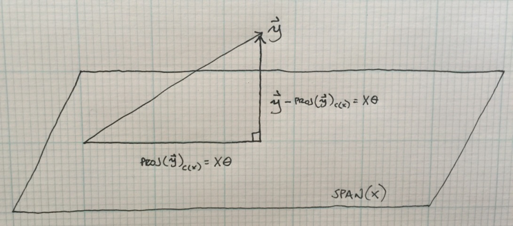
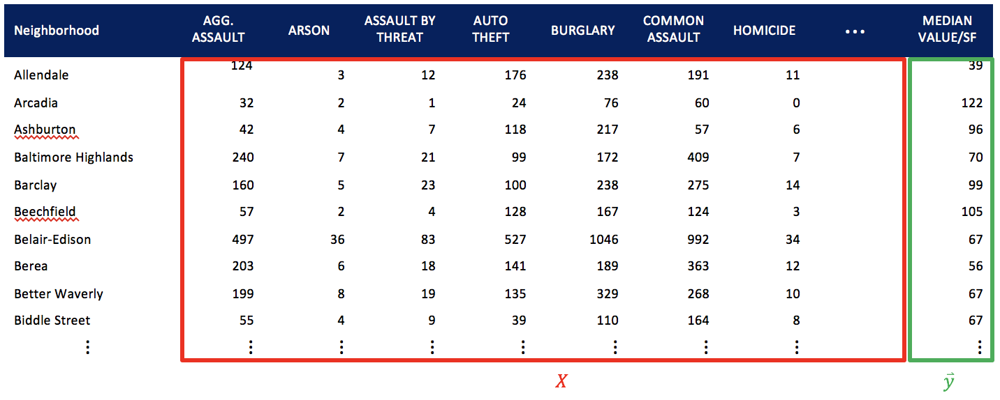

### I.	Introduction

Housing values are often assessed by the sales price of similarly sized and located homes. While assessors control for variables such as square feet, number of bedrooms and numbers of bathrooms, the impact of crime in the neighborhood is not taken into account. By compiling crime data from the City of Baltimore and median home values from Zillow, a housing data research service, this paper will employ a least squares approximation to derive the cost of crime to housing values.

Quantifying the impact of crime, in dollars, benefits both city officials and residents. For city officials, it can help shape more precise crime-fighting policy and quantify the benefit of reductions of certain types of crime. Additionally, it helps city officials understand how different types of crime can deteriorate the property tax base of the city, which can be useful for long-term financial planning. It also helps city residents understand how different crimes can affect housing values, when determining whether to buy or sell residential property in Baltimore’s neighborhoods.

This paper will first give some background on least squares approximations, define variables, and define the structure of the model. A generalized solution for the problem will then be defined, and with the aid of R, the model will be implemented to solve for the costs. Finally, a conclusion will follow to summarize and reflect on the results. 

### II.	Background
Least squares approximation is a technique used in linear algebra to approximate a solution for an Ax=b that has no solution.  More specifically, it can be employed when a matrix has more rows than columns (m>n), and the n columns only span a small part of the m dimensional space. In these situations, elimination cannot be used to solve Ax=b.

In this model, it will be employed to derive a cost impact to home values of different types of crimes committed within the neighborhoods of Baltimore. First, the following variables will be defined: 

$$
m= \text{number of neighborhoods considered} \\
n= \text{number of types of crimes considered} \\
x_j^i=\text{sum of crime type j in the i^th  neighborhood} \\
θ_j=\text{cost of crime type j} \\
y^i=\text{median home value per square foot in i^th neighborhood} \\
\text{where } 0<j≤n  \text{ and } 0<i≤m
$$
Using these variables the matrix $X$ and vectors $\vec{\theta}$ and $\vec{y}$ can be constructed:

$$
\begin{align}
  X = 
  \begin{bmatrix}
      x_1^{(1)} & x_2^{(1)} & \dots  & x_n^{(1)} \\
      x_1^{(1)} & x_2^{(1)} & \dots  & x_n^{(1)} \\
      \vdots    & \vdots    & \ddots & \vdots \\ 
      x_1^{(1)} & x_2^{(1)} & \dots  & x_n^{(1)}
  \end{bmatrix} 
  
  &&
  
  \hat{\theta} = 
  \begin{bmatrix}
      \theta_1 \\
      \theta_2 \\
      \vdots \\ 
      \theta_n 
  \end{bmatrix}
  
  &&
  
  \hat{y} = 
  \begin{bmatrix}
      y_1 \\
      y_2 \\
      \vdots \\ 
      y_n 
  \end{bmatrix}
\end{align}
$$

The equation for expressing the relationship between the matrix $X$ and $\hat{y}$ becomes $X\hat{\theta}=\hat{y}$. The goal of least squares approximation is to find $\hat{\theta}$ so that $X\hat{\theta}$ is as close to $\hat{y}$ as possible, to minimize $||\hat{y}-X\hat{\theta}||$. If $X\hat{\theta}$ is defined as being made up of $m$ row vectors $v^i=x_1^{(i)}\theta_1+x_2^{(i)}\theta_2+ ... +x_n^{(i)}\theta_n$, then the least squares solution can also be expressed as the vector $\hat{\theta}$ that minimizes:

$$
   \left\lVert 
   \begin{align}
   y^{(1)} - v^{(1)}\\
   y^{(2)} - v^{(2)} \\
   \vdots \\
   y^{(m)} - v^{(m)}\
   \end{align}
   \right\rVert^2
   =
   (y^{(1)}-v^{(1)})^2+(y^{(2)}-v^{(2)})^2+...+(y^{(m)}-v^{(m)})^2
$$

### III. Solution

We know that $\hat{y}$ is not in the span of $X$, because $X\hat{\theta}=\hat{y}$ has no solution. Therefore, in order to generate a least squares solution, we need to find a vector in the span of $X$ that minimizes the distance between $\hat{y}$ and $X\hat{\theta}$. We also know that the closest vector to $\hat{y}$ in the span of $X$ is the projection of $\hat{y}$ onto the span of $X$. Knowing this, we can solve for the vector $\hat{\theta}$ that sets $X\hat{\theta}=proj(\hat{y})_{span(X)}$. We start by subtracting $\hat{y}$ from each side of the equation to express it in terms its distance from $\hat{y}$:

$$
X\hat{\theta} - \hat{y} = proj(\hat{y})_{span(X)} - \hat{y}
$$


$X\hat{\theta} - \hat{y}$ exists in the orthogonal column space of $X$, $X\hat{\theta} - \hat{y}  \in C(X)^{\perp}$.The orthogonal column space of $X$ is equal to the null space of $X^T$: $C(X)^{\perp}=N(X)^T$. We can now use this relationship to continue to solve for \hat{\theta}:

$$
X\hat{\theta} - \hat{y} = N(X^T) \\
X^T(X\hat{\theta} - \hat{y}) = \hat{0} \\
X^TX\hat{\theta} - X^T\hat{y} = \hat{0}\\
\hat{\theta} = (X^TX)^{-1}X^T\hat{y}
$$

This equation can now be used to calculate the vector $\hat{\theta}$ of length $n$, which is our least squares solution. It is also useful to visualize this relationship. Although the problem has been simplified into $\mathbb{R}^3$, the following plot helps to visualize how we relate the vector $\hat{y}$ and the linear combination $X\hat{\theta}$:



We are seeking to minimize $||\hat{y}-X\hat{\theta}||$, which is the vector orthogonal to the plane of the $span(X)$. Essentially, $\hat{y}-X\hat{\theta}$ is minimized when $X\hat{\theta}=proj(\hat{y})_{span(X)}$, so by solving for $\hat{\theta}$ we find the linear combination in the $span(X)$ that minimizes $||\hat{y}-X\hat{\theta}||$.


### IV. Generalization



The crime dataset was downloaded from the City of Baltimore’s open data website. It consists of ~256,000 crimes committed dating back to January 1, 2011. The data was then further processed to summarize the crimes committed in the $m=278$ different neighborhoods over the $n=15$ crime types to build the matrix $X$. Median home values by neighborhood were then downloaded from Zillow and merged with X to create our vector $\hat{y}$. Using R, the matrix $X$ and the vector $\hat{y}$ are simply inserted into the equation $\hat{\theta} = (X^TX)^{-1}X^T\hat{y}$, to derive a solution for $\hat{\theta}$ of length $n$, for each crime type.

```{r}
setwd("~/Repos/MATH240")

library(plyr)
library(reshape2)
library(knitr)

crime_dat = read.csv("BPD_Part_1_Victim_Based_Crime_Data.csv")
crime_dat = ddply(crime_dat, c("Neighborhood", "Description"), summarise, Crimes = sum(Total.Incidents))
crime_dat = dcast(crime_dat, Neighborhood ~ Description, value.var="Crimes")
crime_dat[is.na(crime_dat)] = 0

hvi_dat = read.csv("Neighborhood_medianValuePerSqft_AllHomes.csv")
hvi_dat = subset(hvi_dat, hvi_dat$City == "Baltimore")
hvi_dat = hvi_dat[,c("RegionName","X2016.03")]
colnames(hvi_dat)[1] = "Neighborhood"

data = merge(crime_dat, hvi_dat, by = "Neighborhood")
y = data[,length(colnames(data))]
m = length(y)
X = as.matrix(data[,3:length(colnames(data))-1])

theta = as.vector( solve(t(X) %*% X) %*% t(X)%*%y )

result = as.data.frame(cbind("Crime" = colnames(X), theta), stringsAsFactors = FALSE)
result$theta = round(as.numeric(result$theta), 2)
kable(result[order(theta),], row.names = FALSE)

```

### V. Conclusion

Homicides and arson are the most costly to Baltimore’s home values, as this model approximated -$4.05, and -$3.01, respectively, of lost neighborhood home value for each crime committed. Knowing this is important for a city official in quantifying the benefit of enacting crime-fighting policy. For example, the Belair-Edison neighborhood of Baltimore had 34 homicides since 2011, with a current median home value of $67/SF.  If the next five year homicide rate can be reduced by ~20%, or 7 homicides, to 27, this model implies home values in the neighborhood increasing to $95/SF. At the City’s current property tax rate of 2.2%, this creates $0.62/SF of additional tax value on the $28/SF of incremental property values in the neighborhood.

It is also interesting to see positive values in the table: for example, auto thefts and burglaries contributing $0.52 and $0.28, respectively, of increased home value for every crime committed. This implies that the higher valued neighborhoods tend to have more auto thefts and burglaries than the lower valued neighborhoods. Perhaps this is a result of higher disposable income in the area, and thus, more cars to steal and more valuable household items to burglarize. In order to improve the model, perhaps it would be more useful to look at the “theft” types of crime as being normalized to control for the disposable income in the neighborhood. 

Although this model is not perfect, it is useful in seeing how crimes committed in Baltimore’s neighborhoods relate to median home values. This is valuable for Baltimore’s city officials and residents to understand. Linear algebra is the tool that helps us approximate this relationship.

### VI. References

Baltimore City Police Department, Baltimore City Open Data, [Data file]. Retrieved from https://data.baltimorecity.gov/Crime/Crime-by-Neighborhood/6ayg-3z5z 

Zillow Research, Zillow Home Value Index (ZHVI) [Data file]. Retrieved from http://www.zillow.com/research/data/ 


